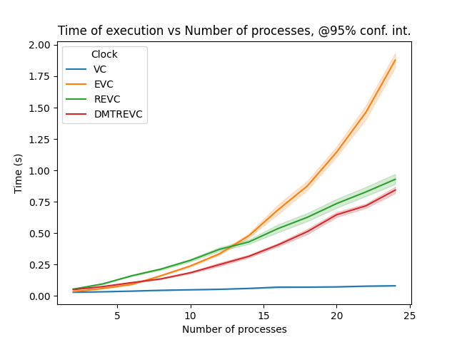
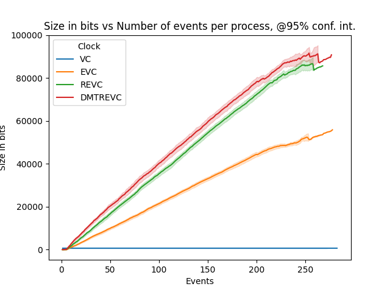

# Introduction

A fundamental challenge in distributed systems is tracking the order of events occurring. In order to track ordering and causality relations, several ideas have been put forward by the scientific community over the years, such as Lamport’s _happened-before_ relation and logical clocks [@lamport].

Logical clocks and especially _vector clocks_ have since become essential in the design of distributed systems. However, they have an important limitation. Researchers, building upon the vector clock have proposed different variations to tackle these limitations, one of which is the Resettable Encoded Vector Clock (REVC) [@revc].

In this work, we present the REVC, and proceed afterwards to create an implementation of it and measure its properties in comparison to other types of vector clocks.

# The Resettable Encoded Vector Clock

<!-- What it is, Why use it - what problem it solves - what advantages it "promises" to have - "the REVC’s growth rate is linear in the number of events executed" -->

<!-- REVC internals, how it works -->

# Implementation

# Experimental Evaluation

## Setup

For evaluating experimentally the properties of the REVC, we created a model of a generic distributed system. The toolkit that we leveraged for this model is _Akka Actors_. Akka provides a concurrency API built on the _Actor concurrency model_, which is intuitive and easy-to-use for simulating reactive systems.

More specifically, our setup consisted of $n$ local actors that can all communicate with each other by exchanging messages. These actors are modelling the processes of a distributed system. Each of them holds 4 clocks, one for each type of clock we have implemented (VC, EVC, REVC, DMTREVC), and each message sent carries 4 "timestamps", i.e. instances of each clocks' state at a single point in time - we did not pass references to the clocks because we would risk the clocks getting updated when another process is using them. 

To assert the correctness of our implementation we resorted to randomness. Concretely, we relied upon our vector clock (VC) implementation, which is very straightforward and we are certain that it is correct, to check the correctness of the rest of the clocks - EVC, REVC, DMTREVC. We used a large number of random exchange of messages between the actors, which creates a random order in the reception of messages, from each actor's point of view. Each actor then continuously checks the _happened-before_ relationships implied by the clocks, and asserts that all of them are consistent.

What we refer to in the results as a single "run", is the following procedure: The system spawns $n$ actors, and after they all initialize their clocks, the first actor picks another one randomly, and sends a message with timestamps. The other actor, upon receiving this message, will perform the necessary updates on its clocks based on the attached timestamps, pick another actor randomly, and send them a message. This process continues until all processes reach a predefined maximum number of messages, after which they exit.

## Results

The properties that we evaluate are primarily related to the scalability of the REVC.

First, we assess the scalability in terms of time - how much a system that uses the REVC for causality tracking "slows down" as its number of processes grows larger. For this, we ran our setup 10 times, with the max number of received messages for each process set to 200. We increment the number of processes from 2 to 24 with a step of 2, and we keep track of the total time of execution. The results are shown in Figure [1](#fig1) (at the 95% confidence interval).

{#fig1 width=500px}

As we can see, the REVC has indeed a lower growth rate in comparison to the EVC, just as stated in the original publication [@revc]. However, we cannot say the same about the DMTREVC, which seems to perform poorly as the number of processes increase.

Then we proceed to assess the growth in the size of the internal data structures of the REVC. As the original paper [@revc] states that the REVC's growth rate is linear to the number of events in the system, our horizontal axis is also the number of events. To be more precise, as this is done from the point of view of a single process, it is the number of messages it has received up to a point, but since in our system an event is associated with a message the representation is the same. We therefore run the system for 10 times and maximum number of messages set to approximately 200 again, and record the number of bits used by the internal data structures of all 4 clocks, as the number of events grows from 1 to approximately 200. The results are shown in Figure [2](#fig2) (also at the 95% confidence interval).

{#fig2 width=500px}

It is evident that the REVC ends up being more intensive in respect to the space it uses, compared to the EVC. It seems to grow linearly to the number of events though, confirming the statements of the original paper [@revc]. The DMTREVC on the other hand performs very poorly. The volatility observed in the DMTREVC can be explained by ... <!-- TODO Jesse help -->

# Discussion

For the DMT, the "management" of the extra data structure (the list) seems to really hinder its scalability. The same can probably be said about the REVC itself.

<!-- Add more -->

# Conclusion

# References
